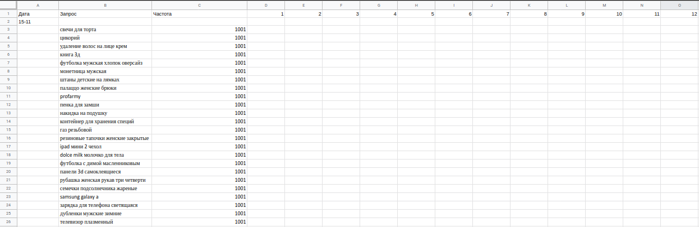

### Сервис заполнения данных в google-spreadsheet таблице "корзинка"
Корзинка — это набор поисковых запросов с топ-12 нмками из выдачи. 
По корзинке из 500 запросов мы ежедневно оцениваем релевантность выдачи. 
Одну и ту же корзину переоцениваем ежедневно на протяжении двух недель

### Что требуeтся сервису для работы
- ID созданной гугл таблицы (как флаг сервиса spreadsheet-id)
- В случае приватных настроек таблицы (доступ не "для всех по ссылке", а только по определенным email'ам) открытый доступ для bucket@bucket-368618.iam.gserviceaccount.com (email сервиса)
- Лист с таблицей, заполненной для первого дня (с датой первого дня отработки сервиса, то есть 14.11 создаем корзинку с первой датой 15.11 и ожидаем отработку сервиса 15.11) "пустой корзинкой" - указаны только: дата, запросы и частота

Ожидаемый формат листа "корзинки" для обновления данных сервисом:

    - Лист текущей корзинки располагается первым по счету в таблице (нулевой индекс)!
    - Таблица из 15 стобцов
    - Первая строка заголовочная (не используется сервисом): Дата, Запрос, Частота, НМ1, ..., НМ12
    - Столбец "Дата" заполняется в единственной строке над всеми запросами текущего дня в формате: dd-mm (16-11, например)
    - Число запросов под датой неограниченно, но подразумевается, что запросы первого дня (будем брать их как основные) совпадают с запросами последующих дней
Пример таблицы:

То есть, для работы сервиса от человека требуется:
    
    1. Создать новый лист с текущей "корзинкой", переместить его на первую по порядку позицию (с нулевым индексом)
    2. Указать дату первого ожидаемого прохода алгоритма и заполнить лист в соответствии с ожидаемым форматом
    3. Ожидать обработку "корзинки" сервисом в дату первого прохода
    4. (Итеративно) заполнить данные по релевантности для НМок, установленных сервисом, ожидать обработку "корзинки" сервисом на следующий день (повторять итеративно, пока не требуется новая "корзинка", если требуется - перейти на первый шаг) 

### Алгоритм работы сервиса
- Получаем список запросов "корзинки" и их частоту (так как ожидаем, что запросы одинаковые для каждой даты - получаем их с ячеек после первой даты B3:B503)
- Проходим по всем запросам, по всем НМкам (по заполненным "корзинкам") сохраняем последнюю оценку (+,-,+-) каждой НМки каждого запроса: запрос => НМ => оценка
- Находим последнюю дату формата dd-mm в A столбце, если эта дата сегодняшняя (значит это "первая корзинка" нужно заполнить НМки для неё), если последняя дата не сегодняшняя, то добавляем новую строчку в конец и заполняем соответствующую ячейку столбца А текущей датой
- Для каждой строки после текущей даты делаем следующей:
    - Берем соответствующий порядковый запрос и его частоту из списка запросов "корзинки"
    - Получаем поисковые НМки для запроса по: https://search.wb.ru/exactmatch/ru/common/v4/search?appType=1&couponsGeo=12,3,18,15,21&curr=rub&dest=-1029256,-102269,-1278703,-1255563&emp=0&lang=ru&locale=ru&pricemarginCoeff=1.0&reg=0&regions=68,64,83,4,38,80,33,70,82,86,75,30,69,48,22,1,66,31,40,71&spp=0&resultset=catalog&query=
    - Получаем рекламные НМки для запроса по: https://catalog-ads.wildberries.ru/api/v5/search?keyword=
    - Объединяем полученные НМки, формируя список НМок для 12 позиций, для каждой НМки смотрим оценку для текущего запроса:
    если оценки нет и первая дата не совпадает с текущей (это не "первая корзинка", в ней не нужно отмечать неоцененные НМки), то ячейка с НМкой будет окрашена в желтый цвет
    - Итоговый формат ячейки с НМкой: [p (маркер рекламы)][nm][estimation], пример: p100110001+, 22223333-
    - Заполняем строку в формате: [Пустота:столбец даты], [Запрос], [Частота], [НМка с оценкой либо окрашена цветом] {0-12 повторений}
